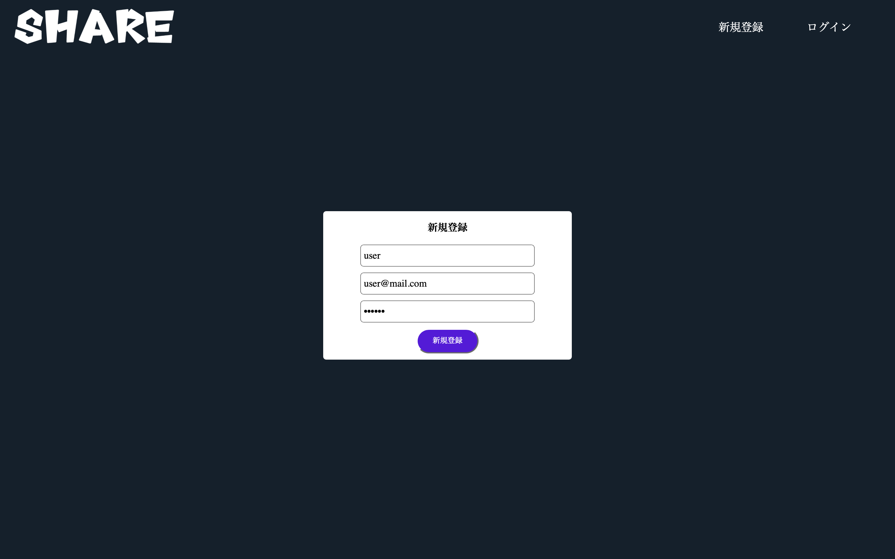
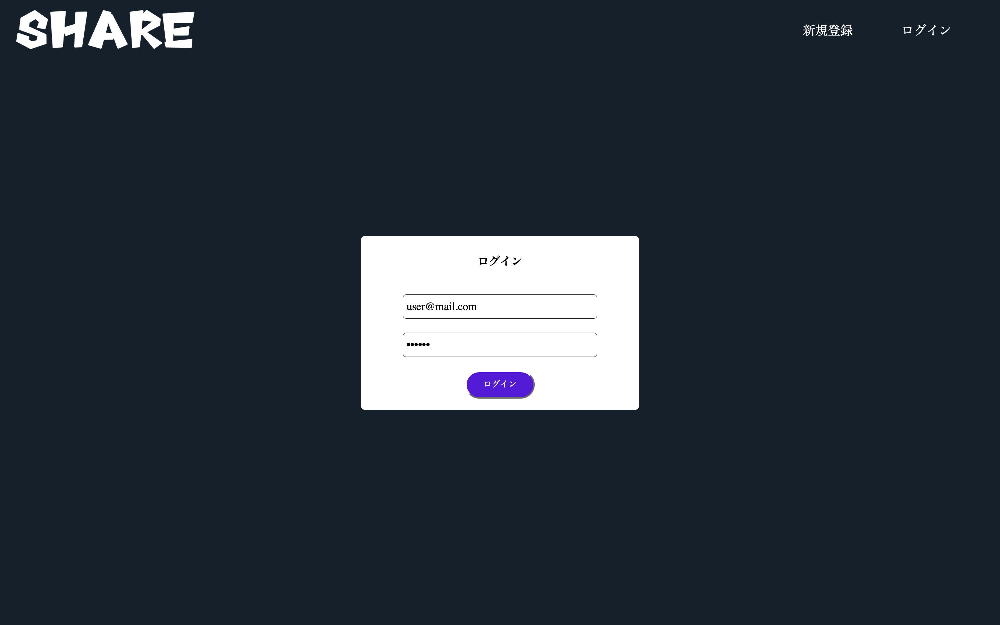
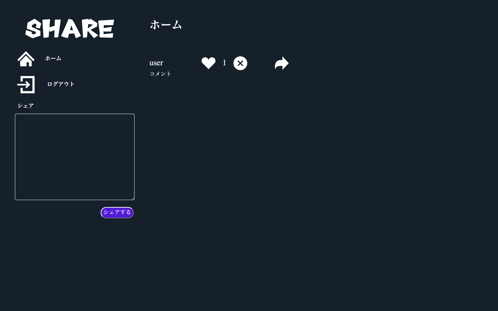
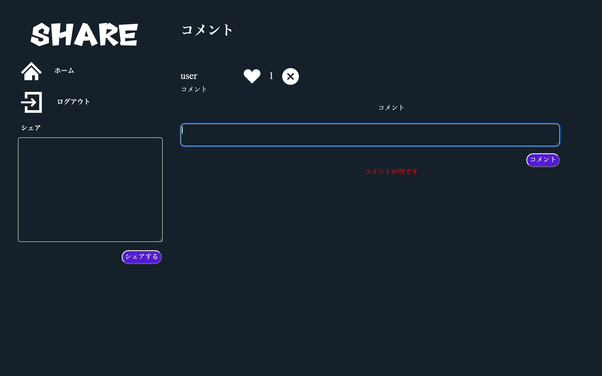
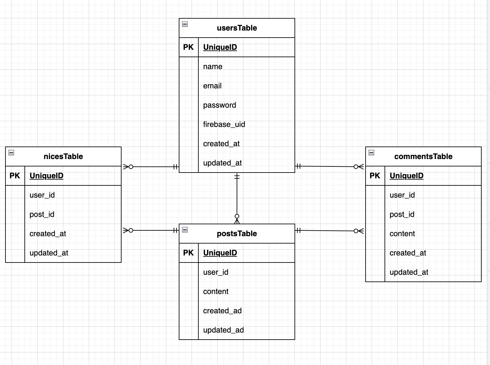

# Twitter風SNSアプリ sns-share

## アプリ概要

投稿の追加・削除、投稿へのコメント、いいねができるシンプルなSNSアプリです。フロントエンド(Nuxt)とバックエンド(Laravel)を分けて開発しています。

## 目次
- [アプリ概要](#アプリ概要)
- [画面イメージ](#画面イメージ)
- [環境構築](#環境構築)
- [使用技術](#使用技術)
- [ER図](#er図)
- [設計・実装のポイント](#設計実装のポイント)
- [URL](#url)

### 主な機能
- 会員登録 / ログイン / ログアウト(Firebase Authentication)
- 投稿の追加 / 削除
- 投稿へのコメント
- 投稿へのいいね

## 画面イメージ
### 会員登録画面

### ログイン画面

### ホーム(投稿一覧)画面

### コメント画面


## 環境構築

### 動作環境
- Docker / Docker Compose
- Node.js v22
- yarn
- Firebase(プロジェクトの作成が必要)

### プロジェクトのクローン

```bash
git clone git@github.com:hi-san10/sns-share-project.git
```

### Firebaseプロジェクトの作成

1. Firebaseコンソールにアクセスし、新しいプロジェクトを作成する
- [https://firebase.google.com/?hl=ja](https://firebase.google.com/?hl=ja)
2. Authentication からログイン方法を「メール/パスワード」に設定する
3. プロジェクトの設定 → サービスアカウント から新しい秘密鍵を作成する
4. ダウンロードした秘密鍵を `serviceAccountKey.json` という名前で以下に配置する
- `backend/src/storage/app/firebase/serviceAccountKey.json`
5. プロジェクトの設定 → マイアプリ から Webアプリを追加し、表示される `firebaseConfig` の値を控えておく(Nuxt側の設定で使用)

### Laravel環境構築

*MYSQLは、OSによって起動しない場合があるのでそれぞれのPCに合わせて docker-compose.yml ファイルを編集してください。

1. docker-compose up -d --build
2. docker-compose exec php bash
3. composer install
4. .env.example ファイルから .env を作成し、docker-compose.ymlに応じて環境変数を変更
5. .env に秘密鍵のパスを設定する

```env
FIREBASE_CREDENTIALS=/var/www/storage/app/firebase/serviceAccountKey.json
```

6. php artisan config:clear
7. php artisan key:generate
8. php artisan migrate

### Nuxt環境構築

以下は `frontend` ディレクトリで実行します。

1. yarn install
2. firebase.client.ts.example ファイルから firebase.client.ts を作成し、控えておいた `firebaseConfig` の値を設定する
- `cp plugins/firebase.client.ts.example plugins/firebase.client.ts`
3. .env を作成し、Laravel側のURLを設定する

```env
NUXT_PUBLIC_API_BASE=http://localhost:80
```

4. yarn dev -o で開発サーバを起動(Ctrl + C で終了)

起動後、会員登録画面からユーザーを登録してください。

## 使用技術

- PHP 8.3
- Laravel 8.83
- Vue.js 3
- Nuxt.js 3
- vee-validate 4
- MYSQL 8.0
- Firebase Authentication
- Docker / Docker Compose
- Nginx

## ER図



## 設計・実装のポイント
- フロントエンド(Nuxt)とバックエンド(Laravel)を分離し、API経由でデータをやり取りする構成
- 認証は Firebase Authentication で行い、Laravel 側では Firebase の UID とユーザーを紐づけて管理
- フォームのバリデーションは vee-validate を使用し、フロント側で入力チェックを実施

## URL

- アプリケーション(Nuxt開発環境):[http://localhost:3000](http://localhost:3000)
- phpMyAdmin(開発環境):[http://localhost:8080](http://localhost:8080)